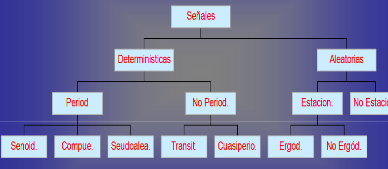
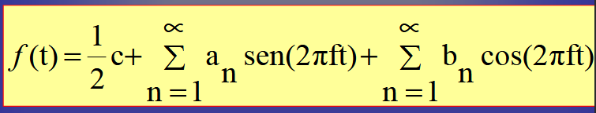
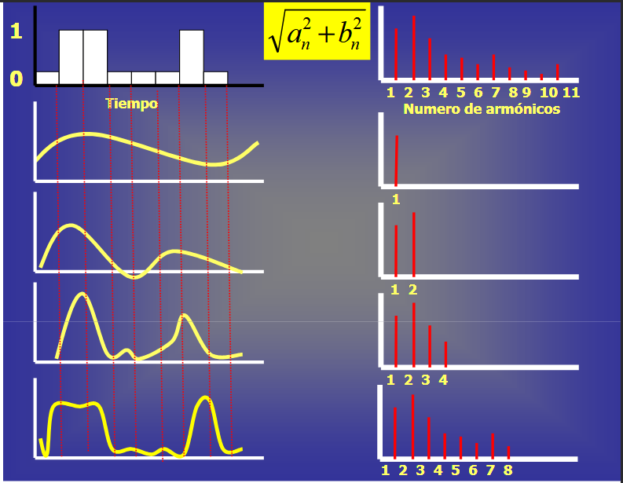
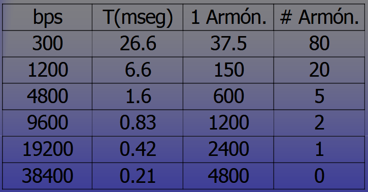
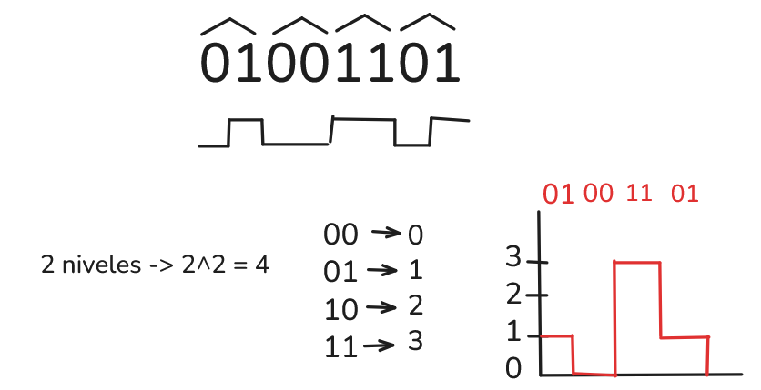

# Representación de la Información - Señales y Señalización

### Señal
Es un elemento o una marca que es utilizado como vector de información.
Representación física de la información (a traves de los sentidos se interpreta la información y se mejoran las inteligencias).
Las primeras señalas que viajaban por cables de cobre, enviaban pulsos eléctricos (código morse).
La mayoría de la información desde lo físico se representa con señales eléctricas.

* Procesamiento de señales: Combinación de niveles de armónicos a través de la serie de Fourier (Física - Eléctrica) Suma de senos y cosenos en el instante n-ésimo.
* Procurar que la señal eléctrica represente la información.
* Las señales tienen que entrar en un sistema de telecomunicaciones. Compuesto por un conjunto de elemetos cuyo propósito es interactual para el intercambio de información, tiene unas entradas que son **señales** (portadora, emisión). Procesaará las señales para ponerlas en el medio físico para que las translade desde el punto A al B.
* Los bits se representan como pulsos eléctricos que la computadora procesa.
* En un sistema yo puedo tener 1 o varias señales al tiempo, el medio físico puede enviar diferentes tipos de señales y se procesan de manera diferente (par trenzado ejemplo)

### Clasificación de las Señales
 

* Periódicas (senoidales o compuestas): Se repiten cada intervalo de tiempo (π/2, π, 3π/2, 2π). Teorema de Fourier
    * Armónicos = Instantes Significativos
    * T = 2π
    * f = 1/T
    * Se tiene en cuenta los momentos, amplitud, frecuencia y el periodo en función del tiempo.
    * La onda que es una representación de una señal
    * an y bn son las amplitudes de seno y coseno del n-esimo armónico.
    * Determinar la frecuencia fundamental f Hz
    
    
    * Si la velocidad es de b Bits/seg, el tiempo que se requier para enviar 8 bits es de T(periodo)=8/b segundos
    * La frecuencia de la primera armónica es f=1/T = b/8 Hzf=1/T = b/8 Hz
    * El numero de armónicos que pueden pasar por una línea telefónica(BW=3KHz) es de 3000/f =3000/(b/8)=24000/b
    * Velocidad de señalización : Cantidad de veces por segundo que la señal cambia su valor (voltaje)segundo que la señal cambia su valor (voltaje)
    * La cantidad de cambios por segundo se mide en Baudios
    * Si la señalización fuera de 16 Niveles de voltaje (0,1,2,3,4,...,15 Voltios) el valor de cada señal serviría(0,1,2,3,4,...,15 Voltios) el valor de cada señal serviría para transmitir 4 Bits.para transmitir 4 Bits. bits/seg = 4 Baudiosbits/seg = 4 Baudios.
    
    
    * Niveles = 2^n
* Determinísticas:

### Tasa máxima del canal
* NyquistNyquist demostró que la velocidad máxima de muestreodemostró que la velocidad máxima de muestreo
de una señal es de 2BW por segundo (BW:BandWidth)de una señal es de 2BW por segundo (BW:BandWidth)
* Si la señal consiste en V niveles discretos, el teorema
dede NyquistNyquist establece que para un canal libre de ruido:establece que para un canal libre de ruido:dede NyquistNyquist establece que para un canal libre de ruido:establece que para un canal libre de ruido:
Tasa de datos maxima =Tasa de datos maxima = bits/segbits/seg
* Para un canal con ruido se halla la relación señal a ruidoruido S/N (S: Potencia señal N: Potencia Ruido)S/N (S: Potencia señal N: Potencia Ruido)
* Generalmente se expresa como: S/N=10 (S/N=10 (10dB10dB), S/N =100 (), S/N =100 (20dB20dB), S/N=1000 (), S/N=1000 (30dB30dB))
* El teorema de Shannon establece para un canal ruidosoestablece para un canal ruidoso
NSLog /10 10 Tasa de datos máxima =Tasa de datos máxima = bits/segbits/se

* RSSI (relacion de potencia - ruido)
    * Entre más negativa significa que está más lejos, la potencia de la señal es muy debil, por lo que la potencia del ruido es un factor que afecta la comunicación
    