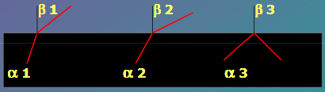
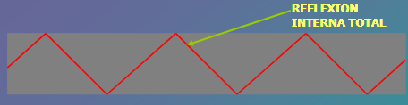
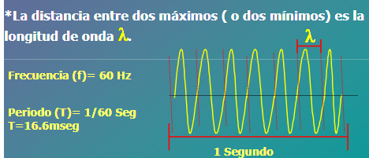
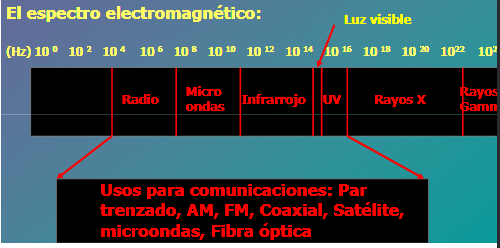
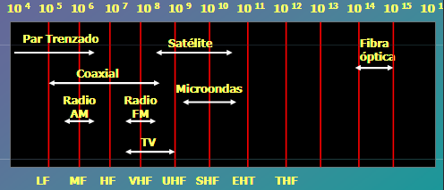
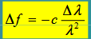
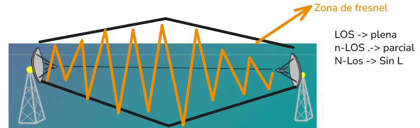

## Transmisión alambrica, medios físicos guiados
### Cable coaxial
* Índice de impedancia para ver si es de banda ancha o banda base (osciloscopio) 50ohm
* Mayor cobertura que el par trenzado(no se puede extender más de 100 - 120 metros por la atenuación).
* Hasta 1km, 2Gbps el de 50ohms diseñado para señales digitales
* Malla
* Banda ancha 75ohms (televisión analógica) eficiente para el transporte de video
    * Cobertura de 100km
    * Un canal de TV necesita 6Mhz para poder funcionar
* Modo sencillo:
    * Comunicaciones entrantes: 5Mhz - 30Mhz, 31-39 para protección de la señal.
    * Comunicaciones salientes: 40Mhz - 300Mhz
* Modo Dual: Un cable para enviar y otro para recibir.

### Fibra Óptica
* Se puede hablar de 10 - 16 - 25Gbps, pero el ancho de banda es cercano a los 50.000Gbps
* La incapacidad de convertir las señales 
* 3 componentes:
    * Fuente de luz: Toma la corriente continua y la convierte en fente de luz
    * La fibra: medio
    * Fotodetector: Toma el pulso de luz y lo convierte a señal digital
* Evolución de la computación: Tubos al vacio -> transistores -> circuitos integrados -> circuitos integrados de alto rendimiento -> chips con microelectrónica.
* Un pulso de luz indica 1 y la ausencia un 0, la fribra hace transporte analógico de la información porque se tiene a pensar que hace transporse digital,
    * El convierte una señal eléctrica a un pulso de luz, si se habla de un pulso de luz se habla de Lambda, longitudes de onda, usa señales analógicas para representar señales digitales
    * Se aplican principios físicos de la óptica, principio de reflexión interna
    * La refracción es el cambio de dirección que experimenta una onda (como la luz) al pasar de un medio a otro con diferente índice de refracción. Este fenómeno ocurre porque la velocidad de la onda varía al cambiar de medio, lo que provoca que la onda se desvíe en la frontera entre ambos medios.
    
    * Los angulos de incidencia son los que permiten que el rayo viaje por la fibra rebotando
    
    * Fibra monomodo:  SOlamente unn pulso de luz y normalmente no tiende a rebotar, angulo de incidencia es 0 para poder viajar lo más recto posible, si viaja sin rebotar puede logar más distancia porque pierde menos energía.
    * Fibra multimodo: Un pulso de luz tiene diferentes ángulos de rebote. 
 
## Medios físicos no guiados
### El espectro electromagnético

Cuando empezamos a mirar la información no sabemos por donde viaja, lo que si es cierto es que va a tener una propagación por el espacio libre, en todo momento se propagan varias radiofrecuencias, los organos procesan diferentes frecuencias.
La propagación inalambrai tiene ciertos componentes:
* La frecuencia, ciclo enmrcado dentro de un segundo

* Las señales se porpan¿gan y normalmente tienen una velocidad de propagación, que equivale a la velocidad de la luz 3x10^8m/s en los medios ideales, lo que si es posible es que se pueda propagar a 2/3 de esa velocidad.

* λ * f = c (velocidad)
* λ * 1Mhz = 3x10^8m/s -> λ = 300m

* La cantidad de información que lleve la onda depende de lo que se ponga, se puede modificar información que se pone en cada ciclo de la frecuencia, la manera en como se codifica.
* Cual sería el ancho de banda para calcular la variación de la frecuencia.

* Que pasa dentro de las antenas?: se concentra la señal, las antenas deben estár alineadas, línea de vista, nos permite que las 2 antenar puedan compartir de manera libre la información dentro de un espacio libre que no vaya a estar obstruido.

