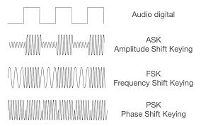

# Técnicas de Modulación

Técnica que se emplea para que información
análoga viaje a una mayor distancia cambiando
características de amplitud, frecuencia y fase de su
Portadora. Reducir los impactos de la atenuacion, ruido, interferencia...
Tipo de Modulación: Modulación por Amplitud (AM), Modulación de Frecuencia o Despl. de frecuencia, Modulación de Frecuencia o Despl. de frecuencia(FM), Modulación de Fase (PM)
* Atenuación: Perdida de la potencia de la señal en función del tiempo (decibeles/metro)

* Cuando 2 señales con diferente amplitud, la potencia disminuye (2senx - 3senx = -senx) pero cuando las senales son iguales se cancelan.
* Amplificador: Aumenta la potencia de la señal
    * Decibelios (db) = define la pérdidas de propagación, pérdida de cables
    * Watio (W) = define la potencia de los transmisores, receptores... en unidades lineales
    * Decibel mW (dBm) = define la potencia de los transmisores, receptores... en unidades logarítmicas
    * Potencia de transmisión (Ptx dBm) = 10*log10(Ptx/1mW) Ejemplo: Convertir 100mW en unidads de dBm -> 10*log10(100mW/1mW) = 20dBm

* Índice de atenuación: sale de la diferencia entre la potencia de la onda, margen de toleracia para decidir si colocar un amplificador o un repetidor.
* Amplificadores: Irradiar más señal o potencia para garantizar que la señal va a viajar más distancia, contrarestar la atenuación
    * Rectificadores ( Series de Fourier )
    * Cuando la señal llega con muy poca potencia no tiene sentido darle más potencia porque esta señal se convierte en un ruido, no restituye la señal.
* Splitter o derivador: nos dice con cuanta pérdida sale la señal, disminuye la potencia de la señal, 
* Zona de fresnel: Es una zona de despeje adicional que hay que tener en consideración cuando se tiene línea de vista o visibilidad
    * Line of sight (LOS)
    * near on Line of sigth (nLOS)
    * No line of sigth (NLOS)
* Distorsión por retardo: Los bits viajan a distintas velocidades, un facto importante desde lo teórico a lo real, para terminos reales no viajan a la velocidad de la luz sino un 2/3 de esa velocidad, puede pasar que un bit rápido sobrepase un bit lento.
    * Bit rápido pasa uno lento: Si un carro llega aantes que el otro se recibe un bit de forma equivocada, entonces la información ya no es la que yo envié, eso determina 2 factores importantes, la distorción por retardo afecta el sistema, tasa de error de bits y tasa de error de paquetes

    * Tasa de error de bits (BER, Bit Error Rate): Es la proporción de bits recibidos incorrectamente respecto al total de bits transmitidos. Un BER alto indica que muchos bits llegan alterados, lo que afecta la integridad de la información.

    * Tasa de error de paquetes (PER, Packet Error Rate): Es la proporción de paquetes de datos que contienen al menos un error respecto al total de paquetes transmitidos. Un PER alto significa que muchos paquetes deben ser descartados o retransmitidos, lo que puede reducir la eficiencia y aumentar la latencia en la comunicación.

* Ruido: Puede verse derivado de fuentes externas o del mismo sistema, mire, recuerdan por que dijimos que el par trenzado estaba trenzado? para evitar ruidos de interferencia entre los mismos pares, cuando se ponen 2 pares cercanos en paralelo se comportan como una antena, Acomplamiento inductivo.
El sistema es el salón y el ruido del ventilador hace ruido.

* Interferencia: Un ruido de afuera, componentes externos al sistema, el sonido afuera del salon es una interferencia.
* Procesamiento de señales: modulaciones, multiplexaciones, esquemas de códificación para volver más eficiente el asunto, cada tipo de señal (digital o analógico), tiene sus componentes bien diferenciados y bien distintos.

* Señal portadora senoidal: Cuando teniamos el telefono fijo, primero escuchabamos el beeeep, esa es la portafora, si no está ese sonido quiere decir que la linea no está habilitada, por lo que no puede poner información, si yo quiero utilizar esa portadora debo poner información.
    * frecuencia, fase... características de una portadora senoidal
* Modular es una transformación de las señales, que busca ajustar la señal de transporte en relacion con la señal de función. Y lo que se hace es afectar las características de la señal protadora, dependiendo de la señal que se está utilizando, se cambia la frecuencia, amplitud o fase
    * ustedes son ustedes pero ahorita salen y cuando tengan que irse a casa se van en medios de transportes distintos, el que se fue caminando se fue en banda base pro que es su forma natural de transportarse, cuando se utiliza un vehiculo, moto, cicla, bus... se está utilizando una señal en la que se monta la información

    * Modulación en AM (ASK): 2 niveles de voltajes (potencia) diferentes, la representación de la potencia representa, si estoy enviando señales digitales, que es 1 y que es 0.
    * Modulación por frecuencia (FSK): 2 tonos o 2 frecuencias diferentes, EN el teléfono uno puede tener activados los beeps del teclado, un tono diferente para identificar el teclado, telefono de baquelita o disco, el disco tenía graduado del 1-0 el recorrido que hacía permitía indicar que número se estaba marcando. Se usan frecuencias distintas para representar la información.
    * Modulación en fase (PSK): permite mandar más bits en cada instante de tiempo, lo que aumenta la información qu ese está enviando.
    

### Modem
Es un dispositivo que acepta un tren serial de
bits (pulsos) a su entrada.bits (pulsos) a su entrada.
* Produce una portadora modulada
* Modula (MO) y Demodula (DEM) la información
* Dispositivo entre equipo Digital (PC) y sistema
análogo (RTPC)
* Teo. Nyquist -> BW= 4 KHz, BWREAL=3KHz(Ideal)
BW= 2.4 KHz (Lin. Tel)

* La modulación garantiza que la información llegue tal cual a su destino.
* Puede viajar por distintos caminos.
* Se transforma porque  

