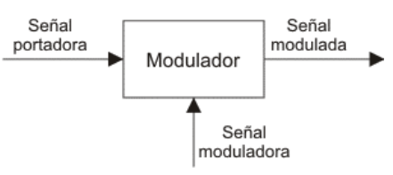
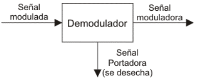
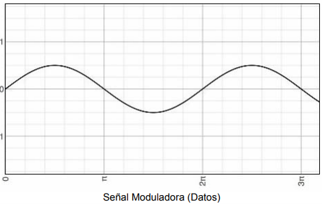
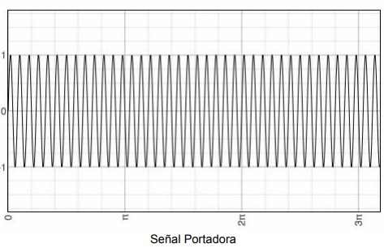
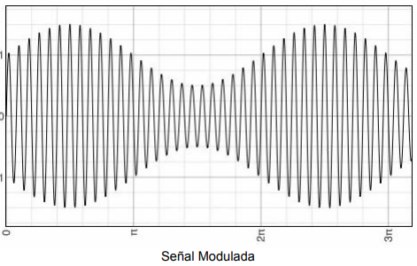
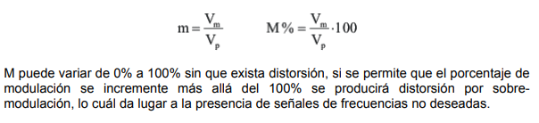
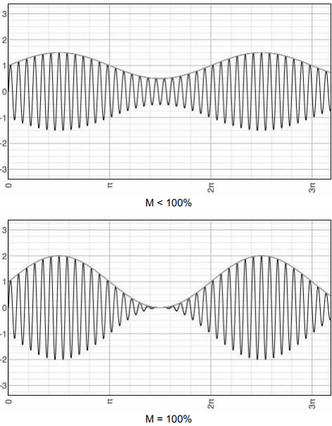
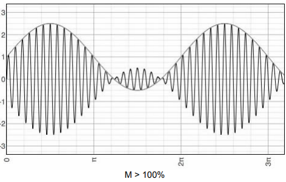

# Modulación
Se denomina modulación al proceso de colocar la información contenida en una señal de baja frecuencia, sobre una señal de alta frecuencia.
Debido a este proceso la señal de alta frecuencia denominada portadora, sufrirá la modificación de alguno de sus parámetros, siendo dicha modificación proporcional a la amplitud de la señal de baja frecuencia denominada moduladora.
A la señal resultante de este proceso se la denomina señal modulada y la misma es la señal que transmite.

Es necesario modular las señales por diferentes razones:
1. Si todos los usuarios transmiten a la frecuencia de la señal original o moduladora, no será posible reconocer la información inteligente contenida en dicha señal, debido a la interferencia entre las señales transmitidas por diferentes usuarios.
2. A altas frecuencias se tiene mayor eficiencia en la transmisión, de acuerdo al medio que se emplee.
3. Se aprovecha mejor el espectro electromagnético, ya que permite la Multiplexación por frecuencias.
4. En caso de transmisión inalámbrica, las antenas tienen medidas más razonables. En resumen, la modulación permite aprovechar mejor el canal de comunicación ya que posibilita transmitir más información en forma simultánea por un mismo canal y/o proteger la información de posibles interferencias y ruidos.

# Demodulación
Es el proceso mediante el cuál es posible recuperar la señal de datos de una señal modulada.

Un MODEM es un dispositivo de transmisión que contiene un modulador y un demodulador.

Diferencias entre 3G, 4G, 5G, es el ancho de banda, presenta problemas de cobertura, mecanicamente las altas frecuencias rebotan cuando se encuentran con los obstáculos, 

# Señales de transmisión analógicas y Señales de datos analógicas

Dentro de deste grupo tenemos los siguientes casos:
## Modulación de amplitud
Este es un caso de modulación donde tanto las señales de transmisión como las señales de datos son analógicas. Un modulador AM es un dispositivo con 2 señales de entrada, una señal portadora de amplitud y frecuencia constante, y la señal de información moduladora. El parámetro de la señal portadora que es modificado por la señal moduladora es la amplitud.

## Modulación exponencial