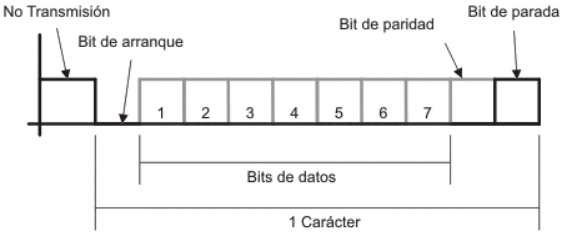
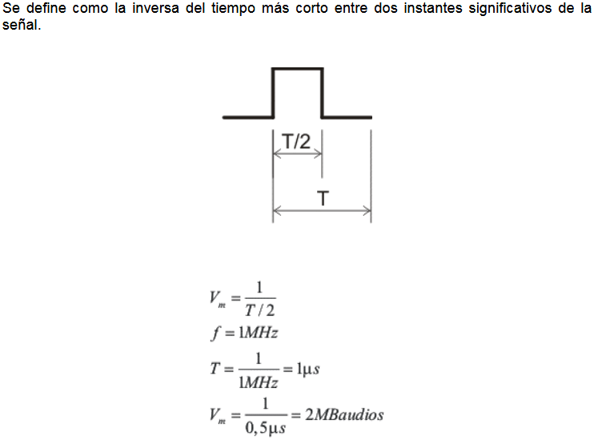
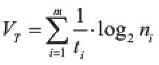
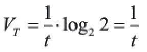
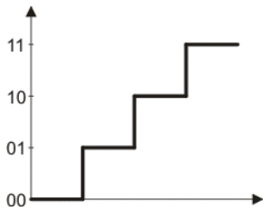
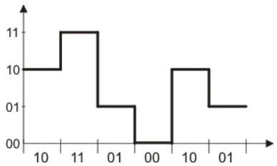

## Transmisión en paralelo

Todos los bits se transmiten simultáneamente, existiendo luego un tiempo antes de la
transmisión del siguiente boque.
Este tipo de transmisión tiene lugar en el interior de una maquina o entre maquinas
cuando la distancia es muy corta. La principal ventaja de esto modo de transmitir datos es
la velocidad de transmisión y la mayor desventaja es el costo.
También puede llegar a considerarse una transmisión en paralelo, aunque se realice
sobre una sola línea, al caso de Múltiplexacion de datos, donde los diferentes datos se
encuentran intercalados durante la transmisión.

## Transmisión en serie
A la salida de una maquina los datos en paralelo se convierten los datos en serie, los
mismos se transmiten y luego en el receptor tiene lugar el proceso inverso, volviéndose a
obtener los datos en paralelo. La secuencia de bits transmitidos es por orden de peso
creciente y generalmente el último bit es de paridad.
El aspecto fundamental de la transmisión serie es el sincronismo, entendiéndose como tal
al procedimiento mediante el cual transmisor y receptor reconocen los ceros y unos de los
bits de igual forma.

El sincronismo puede tenerse a nivel de bit, de Byte o de bloque, donde en cada caso se
identifica el inicio y finalización de los mismos

### Transmisión Asíncrona
Es también conocida como Star / Stop. Requiere de una señal que identifique el inicio del
carácter y a la misma se la denomina bit de arranque. También se requiere de otra señal
denominada señal de parada que indica la finalización del carácter o bloque.
Generalmente cuando no hay transmisión, una línea se encuentra en un nivel alto. Tanto
el transmisor como el receptor, saben cual es la cantidad de bits que componen el
carácter (en el ejemplo son 7).
Los bits de parada son una manera de fijar qué delimita la cantidad de bits del carácter y
cuando e transmite un conjunto de caracteres, luego de los bits de parada existe un bit de
arranque entre los distintos caracteres.
A pesar de ser una forma comúnmente utilizada, la desventaja de la transmisión
asincrónica es su bajo rendimiento, puesto que como en el caso del ejemplo, el carácter
tiene 7 bits pero para efectuar la transmisión se requieren 10. O sea que del total de bits
transmitidos solo el 70% pertenecen a datos.

### Transmisión Síncrona
En este tipo de transmisión es necesario que el transmisor y el receptor utilicen la misma
frecuencia de clock en ese caso la transmisión se efectúa en bloques, debiéndose definir dos grupos de bits denominados delimitadores, mediante los cuales se indica el inicio y el
fin de cada bloque.
Este método es más efectivo por que el flujo de información ocurre en forma uniforme,
con lo cual es posible lograr velocidades de transmisión más altas.
Para lograr el sincronismo, el transmisor envía una señal de inicio de transmisión
mediante la cual se activa el clock del receptor. A partir de dicho instante transmisor y
receptor se encuentran sincronizados.
Otra forma de lograr el sincronismo es mediante la utilización de códigos auto
sincronizantes los cuales permiten identificar el inicio y el fin de cada bit.

## Tipos de comunicación en canales de comunicación

### Simplex
En este caso el transmisor y el receptor están perfectamente definidos y la comunicación
es unidireccional. Este tipo de comunicaciones se emplean usualmente en redes de
radiodifusión, donde los receptores no necesitan enviar ningún tipo de dato al transmisor. (Radiodifusión y teledifusión)

### Duplex o Semi-Duplex
En este caso ambos extremos del sistema de comunicación cumplen funciones de
transmisor y receptor y los datos se desplazan en ambos sentidos pero no
simultáneamente. Este tipo de comunicación se utiliza habitualmente en la interacción
entre terminales y un computador central

### Full Duplex
El sistema es similar al Duplex, pero los datos se desplazan en ambos sentidos
simultáneamente. Para ello ambos transmisores poseen diferentes frecuencias de
transmisión o dos caminos de comunicación separados, mientras que la comunicación
semi-Duplex necesita normalmente uno solo.
Para el intercambio de datos entre computadores este tipo de comunicaciones son más
eficientes que las transmisiones semi-Duplex

## Velocidades de un sistema de comunicaciones

### Velocidad de Modulación

Esta velocidad está dada por la velocidad de cambio de la señal y por lo tanto dependerá
del esquema de codificación elegido.
### Velocidad de Transmisión
Está dada por la cantidad de bits que se transmiten por segundo independientemente de
si los mismos contienen información o no.

Donde ni es la cantidad de niveles del canal i-ésimo que transmite en paralelo; siendo por
lo tanto n la cantidad de canales.
* 1 / ti es la velocidad de modulación del iésimo canal.
Si tenemos un solo canal y trabajando con dos niveles como sucede con el sistema
binario, la velocidad de transmisión resulta

La unidad de medida de la velocidad de transmisión es bits / segundo.
Si se tiene un sistema multinivel, se puede incrementar la velocidad de transmisión sin
cambiar la velocidad de modulación
Si tenemos 2 bits las posibles combinaciones serán:
|0|0|
|0|1|
|1|0|
|1|1|
Si establecemos un nivel para cada combinación obtendremos una señal multinivel

Si aplicamos lo anterior a una secuencia binaria la señal que se transmite tendrá la
siguiente forma
Secuencia binaria: 101101001001

La señal anterior, si bien posee la misma velocidad de modulación que una señal binaria
tiene mayor velocidad de transmisión puesto que cada nivel significa la transmisión de 2
bits (dibit).
El concepto de velocidad de modulación se emplea en transmisiones sincrónicas, puesto
que en transmisiones asincrónicas carece de sentido ya que no se tiene en cuenta la
duración de los bits de arranque y parada.

### Velocidad de Transferencia de datos
Está dada por la cantidad media de bits que se transmiten entre dos sistemas de datos.

### Velocidad de Transferencia Real de datos
Se denomina así a la cantidad de bits transmitidos en la unidad de tiempo, con la
condición que el receptor los considere válidos: VT > VTransf > VR.Transf

Relación entre el ancho de banda y la velocidad de transmisión
Si se tiene un sistema de comunicaciones a través del cual se transmiten datos binarios,
señal cuadrada, y considerando que la frecuencia de dicha señal es de 1 MHz.
De acuerdo al desarrollo de Fourier, por ser la señal cuadrada, solo tendremos armónicas
impares y si aceptamos una deformación que permita despreciar a las señales más allá
de la 5ª armónica, el ancho de banda necesario para transmitir dicha señal será:
BW = 5f – f = 4f
BW = 5MHz – 1MHz = 4MHz

Ahora bien, si consideramos que a dicha frecuencia estamos transmitiendo ceros y unos,
el periodo resultara t = 1 ms, razón por la cual el tiempo de duración de cada bit será
0,5ms y ello implica una velocidad de modulación de 2MBaudios. Si consideramos que se
trata de un solo canal y por ser la señal cuadrada tenemos 2 niveles, resulta que la
velocidad de transmisión y la velocidad de modulación coinciden numéricamente,
resultando la velocidad de transmisión VT = 2Mbits/seg.
Si ahora consideramos tener una señal cuya frecuencia es de 2MHz y aceptamos una
distorsión, al igual que en e caso anterior, que permita despreciar a las señales más allá
de la 5ª armónica, el ancho de banda resultará
f = 2MHz
BW = 5 – 2MHz – 2MHz =10 MHz – 2 MHz = 8MHz
En este caso la duración de cada bit es de 0,25 ms, por lo tanto, siguiendo el mismo
razonamiento del caso anterior, la velocidad de transferencia resultara de 4Mbits/seg.
Si en un tercer análisis consideramos que la frecuencia de la señal es de 2MHz pero
aceptamos una distorsión en la cual se desprecian las señales cuya frecuencia esté más
allá de la tercera armónica, el ancho de banda resultara
f = 2MHz
BW = 3 – 2MHz – 2 MHz = 4MHz
y para la frecuencia dada la velocidad de transmisión es, igual que en el caso anterior, de
4 Mbits/seg.
Del análisis anterior podemos obtener las siguientes conclusiones
Para transmitir una señal sin deformación se requiere un ancho de banda infinito.
Todo medio de transmisión disminuye el ancho de banda, razón por la cual todas las
señales sufren alguna deformación.
Cuanto mayor es el ancho de banda mayor es la velocidad de transmisión que puede
obtenerse.
Cuanto mayor es la frecuencia de la señal, mayor es la velocidad de transmisión puesto
que cada bit tiene un menor tiempo de duración y ello hace que sea posible enviar mayor
cantidad de bits en el mismo tiempo.
