## Bandas de frecuencia en AM
Existe la banda lateral inferior y superior:
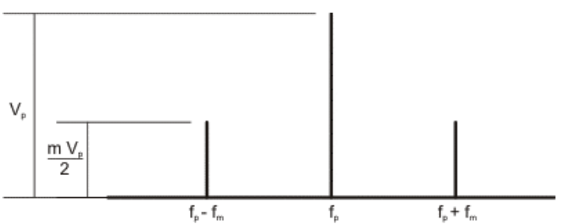

La banda lateral única me indica que voy a utilizar alguna de las 2 bandas, banda lateral superior (Upper Side Band), la inferior (Lower Side Band),
con la amplitud máxima podemos llegar a establecer una relación para la energía:
la portadora va a consumir 2/3 de la señal modulada y solo 1/3 para las bandas laterales

## Modulación exponencial

permite mayor inmunidad ante el ruido, variación del angulo en funcion del tiempo
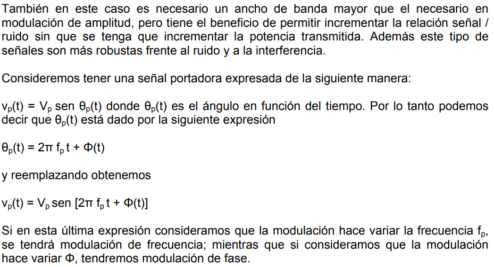

## Modulación de frecuencia
Es un tipo de función exponencial, la señal mantendrá fija su amplitud, el parámetro que varia en la portadora es la frecuencia
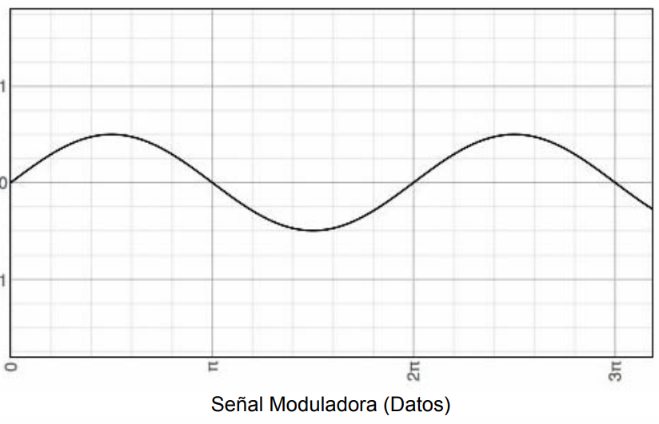
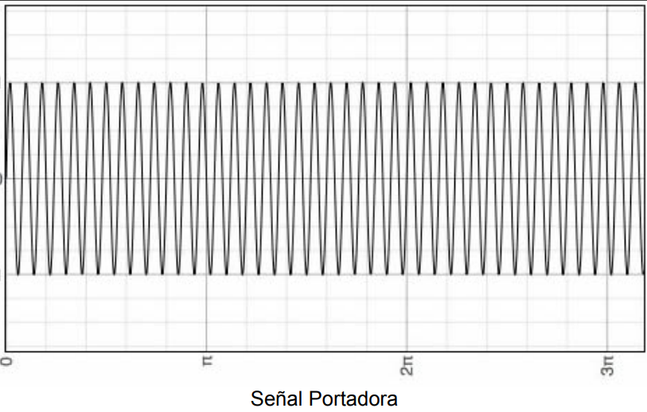
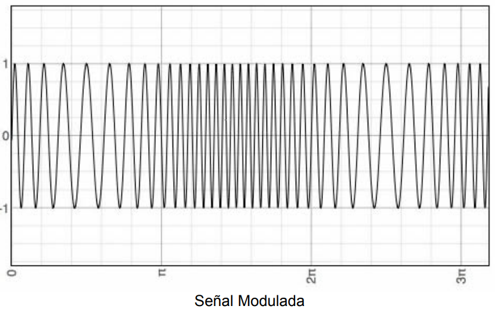
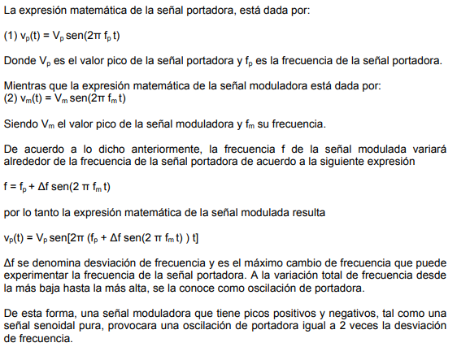
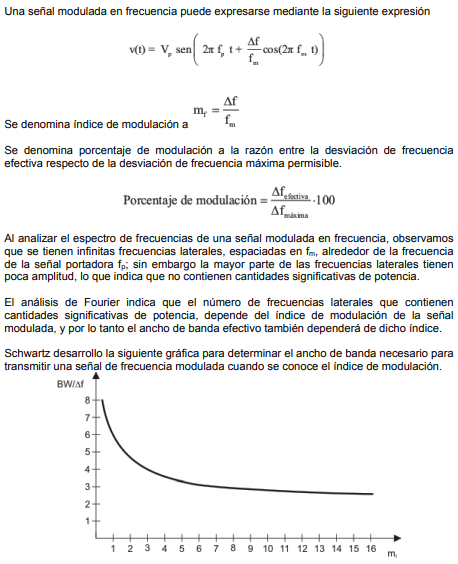

FM de banda ancha o angosta, en la construcción de la gráfica se ha empleado el criterio práctico que establece que una señal de cualquier frecuencia componente, con una magnitud (tensión) menor de 1% del valor de la magnitud de la portadora sin modular, se considera demasiado pequeña como para ser significativa.

Al examinar la curva obtenida por Scwartz se aprecia que para altos valores de mf, la curva tiende a la asíntota horizontal, mientras que para valores bajos de mf, tiende a la asíntota vertical.
Un estudio matemático detallado indica que el ancho de banda necesario para transmitir una señal FM para la cual mf < pi/2, depende principalmente de la frencuencia de la señal moduladora y es totalmente independiente de la desviación de frecuencia. Un análisis más complejo demostraría que el ancho de banda necesario para transmitir una señal de FM, en la cual mf < pi/2, es igual a dos veces la frecuencia de la señal moduladora
BW = 2fm para mf < pi/2.
De igual manera que en AM ya a diferencia de lo que ocurre para FM con mf > pi/2, por cada frecuencia moduladora aparecen dos frencuencias laterales, una inferior y otra superior, a cada lado de la frecuencia de la señal portadora y separadas en fm de la frecuencia de la portadora. Dado lo limitado del ancho de banda cuando mf < pi/2, se la denomina FM de la banda angosta, mientras que las señales FM donde mf > pi/2, se las denomina FM de banda ancha.

Los espectros de frecuencia AM y de fm de banda angosta, aunque pudieran parecer iguales, por medio del análisis de Fourier se demuestra que las relaciones de magnituda y fase en AM y FM son totalmente diferentes.
EN FM de banda ancha se iene la ventaja de tener menor ruido.
En FM el contenido depotencia de la señal portadora, disminuye conforme aumenta mf  con lo que se logra poner la máxima potencia en donde está la información, es decir en las bandas laterales.

## Modulación de fase - PM
Este también es un caso de modulación donde las señales de transmisión como las señales de datos son analógicas y es un tipo de modulación exponencial al igual  que la modulación de frecuencia. En este caso el parámetro de la señal portadora que variará de acuerdo a la  señal moduladora de fase. La modulación de fase no es muy utilizada principalmente por que se requiere de equipos de recepción más complejos que en FM y puede presentar problemas de ambigüedad para determinar por ejemplo si una señal tiene una fase de 0° o 180°.
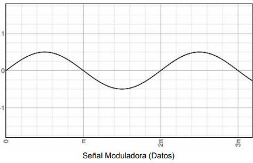

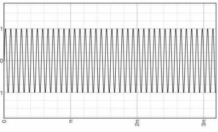

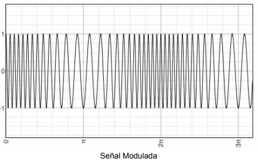

La forma de las señales de modulación de frecuencia y fase son muy parecidad. De hecho, es imposible diferenciarlas sin tener un conocimiento previo de la función de modulación. Consideremos tener una señal portadora dada por: 
Vp(t)=Vp*cos(2pi*fp*t)
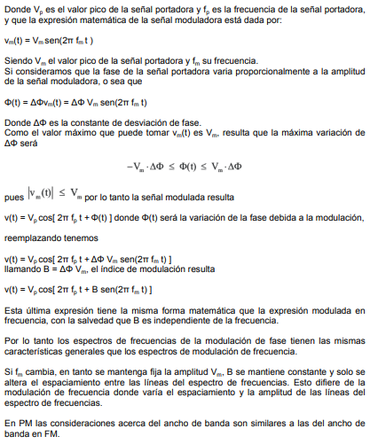

# Señales de transmisión analógicas y Señales de datos Digitales

Dentro de este caso la situación más conocida es la transmisión de datos digitales a través de una red telefónica. Esta red se diseño originalmente para recibir, conmutar y transmitir señales analógicas en el rango de frecuencias de vos (300 a 3400Hz). Por lo tanto esta red no era del todo adecuada para la transmisión de señales digitales. No obstante se pueden conectar dispositivos digitales mediante el uso de los módems, los cuales convierten los datos digitales en señales análogicas y viceversa.
Los modems telefónicos, se utilizan en la red telefónica para producir señales ene el rango de frecuencias de voz, los modems de banda ancha, por ejemplo los modems ADSL y los de cable o cablemodems, utilizan las mismas técnicas pero a frecuencias más altas que las de la voz humana. Dentro de transmisiones con señales de transmisión analógicas y datos digitales tenemos los siguientes casos de técnicas de modulación o codificación dependiendo del parámetro de la señal portadora que es afectado.

## ASK - Desplazamiento de amplitud

Amplitudes-shif keying es una modulación de amplitud donde la señal moduladora es digital. Los 2 valores binarios se representan con dos amplitudes diferentes y es usual que una de las dos amplitudes sea cero; es decir uno de los dígitos binarios se representa mediante la presencia de la portadora en amplitud constante, y el otro dígito se representa mediante la ausensia de la señal portadora. En este caso la señal moduladora vale: 1 o 0. mientras que la señal de transmisión es dado por:
vp(t) = Vp*sen(2pi*fp*t)

Donde Vp es el valor pico de la señal portadora y fp es la frecuencia de la señal portadora, como es una modualción de amplitud, la señal modulada tiene la siguiente expresión:
v(t) = Vp * vm(t)* sen(2pi*fp*t)
Como ya vimos en la señal moduladora vm(t) al ser una señal digital toma únicamente los valores 1 y 0, con lo cal la señal modulada resulta:
Vp * sen(2pi * fp * t) para un "1" binario
0 para un "0" binario
La señal modulada puede reprentarse gráficamente de la siguiente manera.
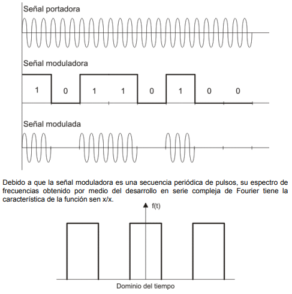

