## Capacidad de un canal

## Capacidad de un canal con ruido

# Codificacion

## Banda base

Se denomina banda base al conjunto de señales que no sufren ningún proceso de
modulación a la salida de la fuente que las origina, es decir son señales que son
transmitidas en su frecuencia original. Dichas señales se pueden codificar y ello da lugar a
los códigos de banda base.
Las señales empleadas en banda base se pueden clasificar de la siguiente forma:

### Unipolares
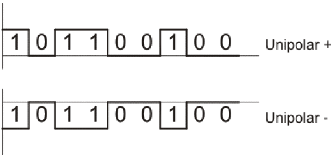

### Polares
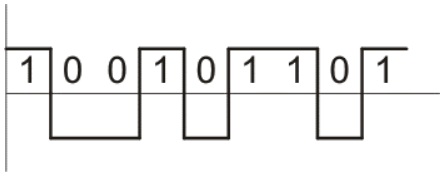

### Bipolares

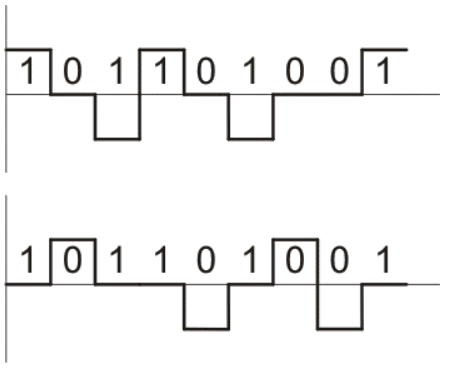

Es utilizada para cortas distancias debido a su bajo costo. El MODEM no efectúa
modulación alguna sino que solo las codifica.
Los datos se codifican para solucionar los siguientes aspectos inherentes a la banda
base:
• Disminuir la componente continua
• Proveer sincronismo entre transmisor y receptor
• Permitir detectar la presencia de la señal en la línea
Como se está trabajando con pulsos, de acuerdo al desarrollo de Fourier, se puede tener
un valor importante de la componente continua. Al codificar se trata de disminuir dicho
valor pues el sistema de transmisión puede poseer amplificadores y/o transformadores
que no tendían en cuenta la componente continua y ello provocaría una deformación de la
señal.
Es posible utilizar banda base en redes L.A.N y en otro tipo de redes siempre y cuando no
se emplee la red pública de comunicaciones

## Códigos usados en banda base

### No Zero Return
Se pueden utilizan los código NonRetourn to Zero Level (NRZ-L), de los cuales los más
empleados son el unipolar y el bipolar.
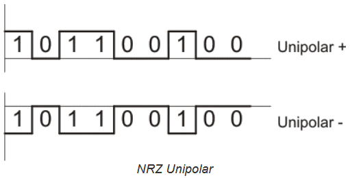
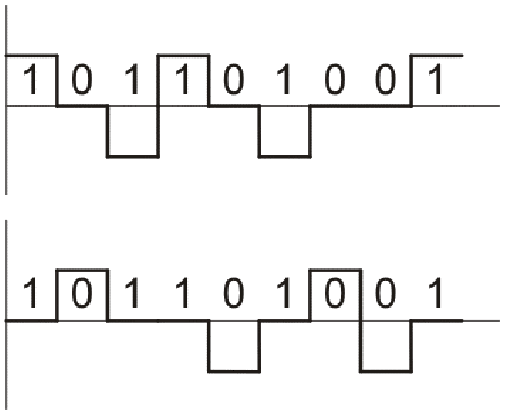

### Zero Return

Se emplea el RZ (Retourn to Zero) polar. En este caso se tiene tensión positiva en una
parte de la duración de un 1 lógico, y cero tensión durante el resto del tiempo. Para un 0
lógico se tiene tensión negativa parte del tiempo y el resto del tiempo del pulso la tensión
es cero. Ayuda el sincronismo y mayor eficiencia.
* Polar: Este código si es autosincronizante debido a que en reloj (clock) del receptor queda sincronizado por la cadencia de los pulsos que llegan del transmisor puesto que todos los bits tienen una transición, esto permite identificar a cada bit en una larga cadena de unos o ceros.
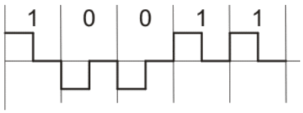

* Bipolar: A la ventaja de ser autosincronizante se le contrapone el hecho de requerir mayor ancho de banda, pues los pulsos son de menor duración que en otros códigos, por ejemplo NRZ, lo cual es una gran desventaja
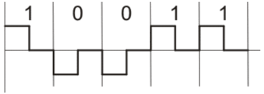

### Codificación diferencial
Sobre la señal de retorno a 0 se hace un muestreo de la señal, dependiendo del valor que se evalue en el instante de timepo, si es 1 ocurre una transición si es un 0 no ocurre transición.
En una codificación diferencial en lugar de determinar el valor absoluto, las señal se
decodifica comparando la polaridad de los bits con la los bits adyacentes.
Tiene dos etapas.
1) Formar la señal diferencial en el transmisor, siendo la misma la que va a ser
transmitida.
2) En el receptor se debe recuperar la señal original.
El procedimiento es el siguiente:
En el transmisor se debe muestrear una señal NRZ. En el instante del muestreo en que se
detecta un 1 se produce una transición mientras que si es detectado un 0 no se produce
ninguna transición.
En el receptor se realiza también un muestreo de la señal recibida pero desfasado en un
50% del tiempo con respecto al muestreo realizado por el transmisor. A la señal recibida
muestreada se la compara con las muestras adyacentes. Si hay transición se decodifica
un 1 si no hay transición se decodifica un 0
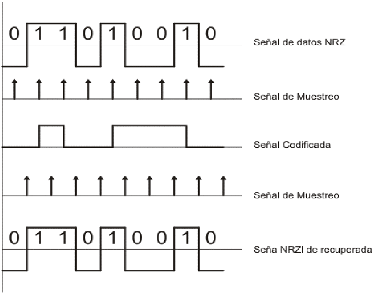

Una ventaja de la codificación diferencial es que en presencia de ruido puede ser más
seguro detectar una transición en lugar de comparar un valor con un umbral. Otra ventaja
es que aún si se pierde la polaridad de la señal, por ejemplo invirtiendo los cables de un
par trenzado, los 0 y 1 no se invertirán; a diferencia de lo que ocurre en códigos no
diferenciales como NRZ.

### Códificación Manchester

En este código siempre hay una transición en la mitad del intervalo de duración de los
bits. Cada transición positiva representa un 1 y cada transición negativa representa un 0.
Cuando se tienen bits iguales y consecutivos se produce una transición en el inicio del
segundo bit la cual no es tenida en cuanta en el receptor al momento de decodificar, solo
las transiciones separadas uniformemente en el tiempo son las que son consideradas por
el receptor.
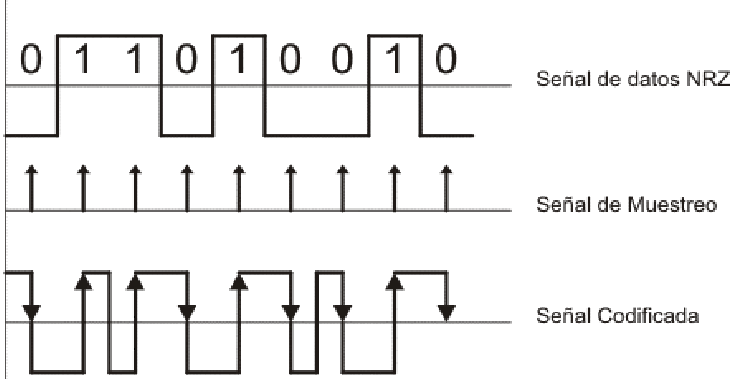

En está codificación no se tienen en cuanta los niveles de tensión sino que solo se
consideran las transiciones positivas y negativas.
Esta técnica posibilita una transición por bit, lo cual permite autosincronismo.
Se puede eliminar la componente continua si se emplean valores positivos y negativos
para representar los niveles de la señal

### Códificación Manchester Diferencial
Durante la codificación todos los bits tienen una transición en la mitad del intervalo de
duración de los mismos, pero solo los ceros tienen además una transición en el inicio del
intervalo.
En la decodificación se detecta el estado de cada intervalo y se lo compara con el estado
del intervalo anterior. Si ocurrió un cambio de la señal se decodifica un 1 en caso contrario
se decodifica un 0.

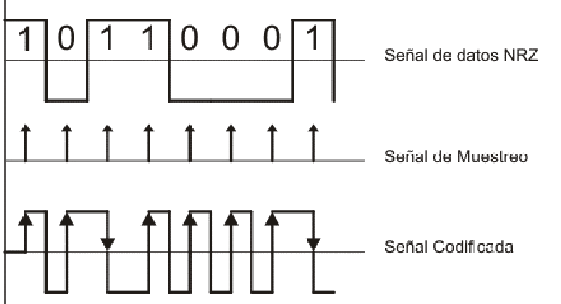
El código Manchester diferencial tiene las mismas ventajas de los códigos Manchester
con la adición de las ventajas derivadas de la utilización de una aproximación diferencial

### CÓDIGO HDB3
Este es un sistema de codificación utilizado en Europa, Asia y Sudamérica. La
denominación HDB3 proviene del nombre en ingles High Density Bipolar-3 Zeros que
puede traducirse como código de alta densidad bipolar de 3 ceros.
En el mismo un 1 se representa con polaridad alternada mientras que un 0 toma el valor
0. Este tipo de señal no tiene componente continua ni de bajas frecuencias pero presenta
el inconveniente que cuando aparece una larga cadena de ceros se puede perder el
sincronismo al no poder distinguir un bit de los adyacentes.
Para evitar esta situación este código establece que en las cadenas de 4 bits se
reemplace el cuarto 0 por un bit denominado bit de violación el cual tiene el valor de un 1
lógico.
En las siguientes violaciones, cadenas de cuatro ceros, se reemplaza por una nueva
secuencia en la cual hay dos posibilidades
000V
R00V
Donde V es el bit de violación y R es un bit denominado bit de relleno.
Para decidir cual de las dos secuencias se debe utilizar se deben contar la cantidad de
unos existentes entre la última violación y la actual. Si la cantidad es par se emplea la
secuencia R00V y si es impar la secuencia 000V.
El primer pulso de violación lleva la misma polaridad del último 1 transmitido de forma de
poder detectar que se trata de un bit de violación.
En la combinación R00V el bit de violación y el de relleno poseen la misma polaridad.

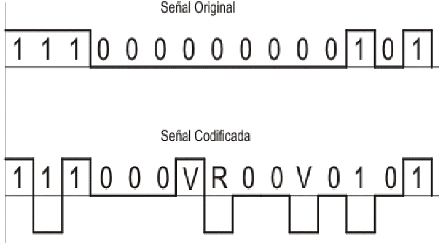
