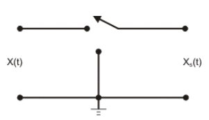
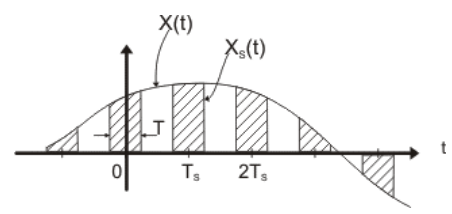
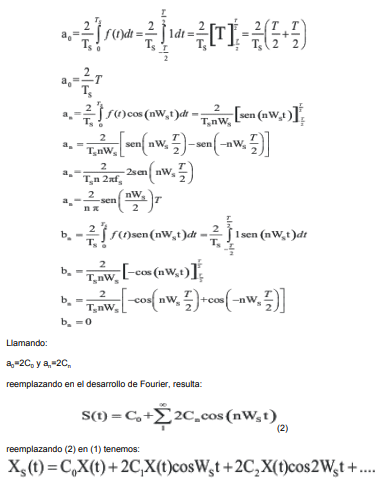
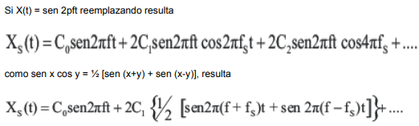
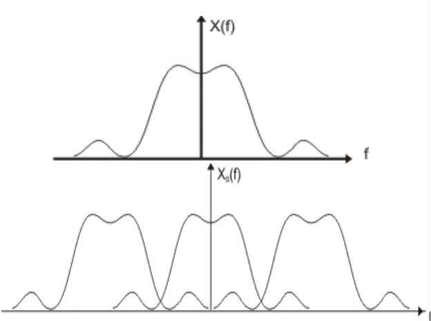
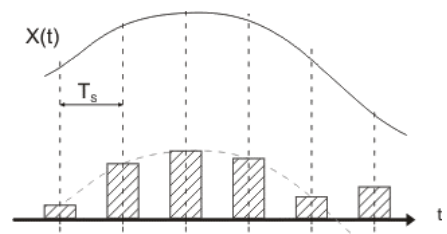
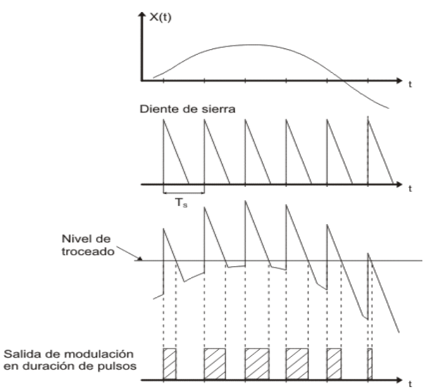
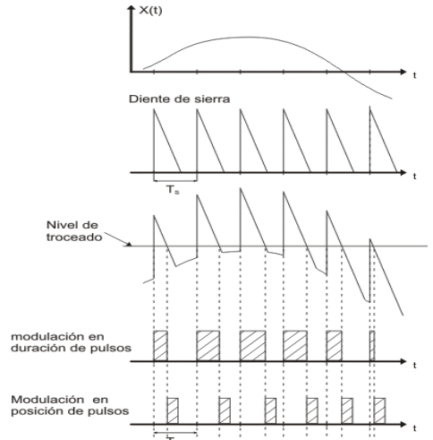
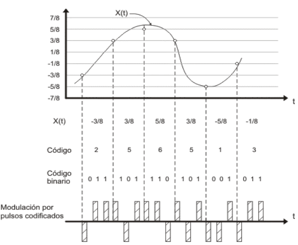
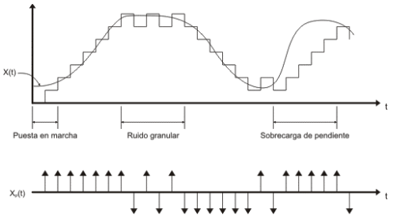

# Senales de transmisión digitales y señales de datos análogas

## Modulación por pulsos
Consiste en tomar muestras de la señal moduladora de datos a intervalos regulares, de modo que el receptor a através de dichas muestras pueda reconstruir la señal de datos original.
En modulación de pulsos la información no está contenida en toda la señal moduladora, sino que en la información está codificada en forma digital mediante un muestreo adecuado. En demodulación, en general es suficiente con detectar la esistencia o no de un pulso.
En la modulación de pulsos algún parámetro de pulso varía de acuerdo a un valor muestra de información.
Los pulsos representativos de la señal moduladora son de muy corta duración en comparación, al tiempo entre ellos. Debido a esta circunstancia, la potencia transmitida se puede concentrar en ráfagas cortas, en lugar de ser enviada de forma continuada.
La modulación de pulsos es más una técnica de procesamiento de información que una modulación, puesto que no hay translación de fase.
## Muestreo
Una aproximación simple del muestreo, se consigue por medio de la operación de conmutación.

EL conmutador contacta periódicamente entre 1 y 2 con una frecuencia de fs = 1/Ts, y permanece en contacto con el Terminal 1 de la señal de entrada un tiempo T, para luego estar contactando a masa el resto del tiempo Ts a fs, se la denomina frecuencia de muestreo, siendo Xs(t) la señal modulada (muestreada).
Si llamamos S(t) a la función de conmutación (forma de variación de la conmutación), siendo la misma una secuencia periódica de pulsos de muestreo de amplitud unitaria, podemos considerar a la modulación como el producto de la señal moduladora de datos por la función S(t).

La expresión anterior indica que la operación de muestreo ha dejado al espectro del mensaje de datos intacto ( primer término), repitiendolo periódicamente en un espaciamiento fs.
Si el ancho de banda de la señal de datos (el ancho de banda necesario para que la señal recibida se corresponda con la señal emitida, o sea, para que la deformación sea mínima) es W, para que las bandas laterales no se solapen, la frecuencia de muestreo fs, debe ser como mínimo:
fs - W = W de donde obtenemos la frecuencia de muestreo mínima
fs = 2W
a esta frecuencia se la denomina velocidad de nyquist y una demostración más rigurosa se obtiene por medio de la teoría de muestreo
Por lo tanto, la velocidad de muestreo debe ser fs > 2W
y por lo tanto el periodo de muestreo resulta Ts = 1/fs = 1/2W
Y cuando eso satisface, en el receptor se filtra Xs(t) por medio de un filtro pasabajos obteniendose a la salida del mismo una señal que será proporcional a X(t), resultando esta la recuperación de la señal de datos.
Si fs < 2W, la señal obtenida no responde exactamente a la señal muestreada, debido al efecto de interferencia de las coles espectrales (aliasing)

## Modulación análoga de pulsos
### Modulacion en amplitud
La señal de muestreo es en general un asucesión de pulsos unipolares, cuyas amplitudes son proporcionales a los valores muestra instantáneos del mensaje de datos.

Puesto que en este caso tiene las mismas características que modulación de amplitud, se desprende que el espectro de frecuencias tendrá las mismas características, repitiendose a fs, 2fs, etc...
### Modulación de pulsos en duración
En este caso la duración del pulso es proporcional a la amplitud de muestra.

En la práctica se fija un flanco de pulso y se modula el otro flanco, con lo que se obtienen pultos de distancia de duración y espaciamiento varaible; ello implica que el análisis espectral es matemáticamente muy complicado.
Para observar que ocurre conceptualmente, consideremos que se fija el flanco ascendente y se modula el flanco descendente, lo cual se logra muestreando la señal diente de sierra, tal como se observa en la siguiente figura: El nivel del muestreo se establece con un limitador y luego la duración de pulsos de la señal modulada por pulsos en duración estará dada por el tiempo que la señal diente de sierra supera el nivel de muestreo.

### Modulación de pulsos en posición
El proceso es el siguiente:
Tengamos una secuencia de pulsos modulados en duración, diferenciamos a los mismos y se los interviene, obteniendose la siguiente figura:

El principal uso de PPM es debido a que es más eficiente la generación y detección de los pulsos modulados en comparación en PDM. Esto es debido a que la información reside en la ubicación en el tiempo de los flancos de los pulsos y no en los pulsos en sí mismos. Por ello se generan pulsos de corta duración en los cuales sólo es importante la posición de los mismos.
Q es la propabilidad de que un evento ocurra y Qc es la probabilidad de que no ocurra.
### Modulación en pulsos codíficados
Esta modulación es un esquema para transmitir una señal de datos analógica en una señal digital. Cuando una señal modulada se altera con el ruido, no existe en el receptor formar alguna de distinguir el valor transmitido exacto. Sin embargo, si solo se permiten unos pocos valores discretos del parámetro modulado y si la separación entre dichos valores es grande en comparación con la perturbación producida por el ruido, será más sencillo decidir con presición en el receptor, los valores específicos transmitidos.

2A/n, donde a es el nivel en X(t) y n el número total de niveles (log2(n)).
En la modulación de pulsos codificados (PCM = Pulse code Modulation), para concretar lo antedicho, se debe realizar un muestreo de la señal, cuantificar la misma y codificarla. El codificador convierte las muestras digitales en un código adecuado y de esta forma se genera la correspondiente señal modulada.
Como se requieren varios dígitos para cada muestra del mensaje, el ancho de banda en este caso es mucho mayor que el ancho de banda para el mensaje.
Posteriormente, las eñal obenda se puede transmitir en ASK, FSK, o PSK.

## Modulación delta
Es una modulación donde se convierte un aseñal analógica en una señal digital.
La modulación delta consiste en compara la señal dada con una sucesión de pulsos de amplitud los cuales son crecientes mientras la amplitud de esta sucesión se encuentra por debajo de la amplitud de la señal dada y es creciente cuando la amplitud de los pulsos de muestreo supera la amplitud de la señal.

Como la modulación delta aprocima la señal X(t) mediante una función escalonada lineal, el cambio de la señal debe relativamente lento en comparación con la tasa de muestreo. Este requerimiento implica que la señal debe ser sobre muestreada, es decir muestreada almenos 5 veces mayor que Nyquist.
Sobrecarga de pendiente: Cuando la velocidad de cambio es muy grande se tiene lo que se denomina sobrecarga de pendiente, puede reducirse aumentando la altura de los escalones.
Ruido Granular: Este es el resultado de la utilización de un escalón de altura muy grande en tramos donde la señal tiene poca variación. El ruido granular puede reducirse disminuyendo la altura de los escalones.
La señal obtenida no será transmitida, sino que en su lugar se transmite una sucesión de dígitos binarios los cuales sólo indican la polaridad de los escalones.
La secuencia binaria se puede usar en el receptor para reconstruir la función escalera obtenida durante el muestreo de la señal original. La señal reconstruidapuede suavisarze mediante un procedimiento de integración o mediante un filtro pasa bajos que genere una aproximación analógica a la señal analógica de entrada.
La principal ventaja de la modulación delta con respecto a la modulación de pulsos codificados es que es sencilla de implementar. No obstante en general con la modulación de pulsos codificados se consigue una mejor relación señal ruido que con una modulación delta.

